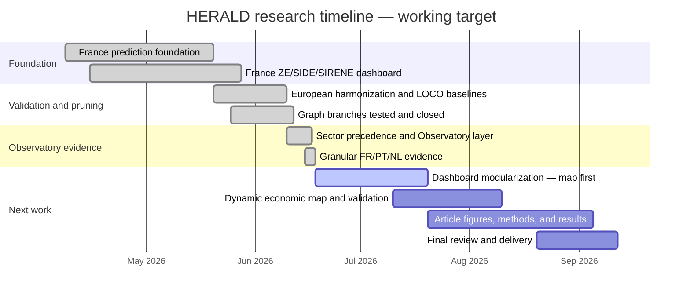

# HERALD — European Territorial Economic Intelligence

HERALD tracks business activity across European territories and sectors over
time. It forecasts expected activity, detects economic states (growth,
stability, decline, recovery), and maps validated sector-to-sector temporal
relations. Every number is tagged with an evidence level — observed, proxy,
robust, supported, exploratory, or blocked — so nothing is presented with
more confidence than the data supports. A recommendation layer is planned
but not yet built.

**To pick this repository up cold, read README.md, then the five canonical reports in
`reports/canonical/`, in order:**

1. `reports/canonical/HERALD_01_PROJECT_PHASES_AND_TRAJECTORY.md` — phase-by-phase history
2. `reports/canonical/HERALD_02_DATA_PROVENANCE_AND_GRANULARITY.md` — what data exists, what it can be used for
3. `reports/canonical/HERALD_03_METHODS_AND_ARCHITECTURE.md` — current architecture, validated vs closed vs partial methods
4. `reports/canonical/HERALD_04_RESULTS_EVIDENCE_AND_CLOSED_BRANCHES.md` — every claim, its evidence, and whether it's citable
5. `reports/canonical/HERALD_05_OBSERVATORY_DASHBOARD_AND_ARTICLE_ROADMAP.md` — dashboard state and what's left for the article

These five replace dozens of individual phase/audit reports as the entry point. The
older reports are not deleted — `reports/HERALD_REPORTS_CONSOLIDATION_MAP.md` says which
canonical document represents each one. For full decision-by-decision traceability, see
`reports/HERALD_METHODOLOGICAL_DECISION_LOG.md` and `reports/HERALD_ACTIVE_DOCUMENT_INDEX.md`.
Full scope and authorised/forbidden claims are defined in
`reports/HERALD_PROJECT_CHARTER.md`, which prevails over any informal description,
including this one.

**Repository naming note:** the current GitHub repository name still contains the legacy
architecture phrase `territorial-recommender-stgnn-mas`. That name is historical and should
not be read as the current HERALD architecture. The current project identity is **HERALD —
European Territorial Economic Intelligence**. If the repository is renamed, the recommended
target name is `herald-territorial-economic-intelligence`.

---

## Traceability maps

Three second-level canonical documents, built on top of the five above, for "how many
phases / what technique / what data / what decision / what failed / what's the
architecture / what's left" at a glance:

- `reports/canonical/HERALD_06_PHASE_TECHNIQUE_MATRIX.md` — one row per phase/block:
  data, granularity, technique, validation, result, DEC-*, status, citability.
- `reports/canonical/HERALD_07_METHOD_LINEAGE_FOR_ARTICLE.md` — the scientific line of
  reasoning in narrative form, written as raw material for the article.
- `reports/canonical/HERALD_08_REPOSITORY_TRACEABILITY_MAP.md` — what each top-level
  folder is, its status, and what must never be cited as a primary source from it.
- `reports/canonical/HERALD_09_DATA_ASSET_MAP.md` — every data path classified as
  canonical / valid-processed / raw-regenerable / historical / blocked-for-training.
- `reports/canonical/HERALD_10_CODE_PATH_MAP.md` — every `src/` module classified as
  active ingestion/build/prediction/relation-evidence/dashboard, historical, closed
  branch, or research-track.
- `reports/canonical/HERALD_11_HPC_AND_RESULTS_MAP.md` — every `hpc/`/`hpc_results/`
  job classified as active, historical, valid, or rejected, with its DEC trace.
- `reports/canonical/HERALD_12_FINAL_PHASE_MAP.md` — the single end-to-end phase table
  (period, question, data, technique, validation, result, status, article/dashboard fit).

`reports/canonical/HERALD_13_ORGANIZATION_BACKLOG.md` is different in kind from
`01`-`12`: it is an **organizational chore list** (uncommitted worktree state, data/code/HPC
items needing a future keep/archive decision), not a scientific or structural result.
`reports/canonical/HERALD_14_WORKTREE_DECISION_AUDIT.md` turns that raw inventory into a
per-group decision table (commit/gitignore/keep-local/needs-new-DEC/etc.) — read it
before acting on anything in #13. Neither #13 nor #14 is a source of scientific claims.

`reports/canonical/HERALD_15_FR_ZE2020_DATA_TREATMENT_PIPELINE.md` documents the France
ZE2020 data layer specifically (raw ingestion through the canonical
`fr_ze2020_model_ready_panel.csv`), and `reports/canonical/HERALD_16_MODEL_TRAINING_BLOCK_AUDIT.md`
is its training-side counterpart: every script in the training block classified
current/legacy/experimental/closed, and the minimal current baseline path. Like #13-#14,
these two are organizational/data-lineage documents, not new scientific results.

---

## Project trajectory (short version)

Full phase-by-phase account: `reports/canonical/HERALD_01_PROJECT_PHASES_AND_TRAJECTORY.md`.
Note: repository evidence (earliest commit) begins **2026-04-08** — no March 2026 activity
is documented in this repo, so "Mar–Apr" below should be read as "Apr" in terms of
verifiable git/report history.

| Period | What happened | Status |
|---|---|---|
| Apr–May 2026 | France prediction foundation: ZE2020, SIDE/SIRENE, Q7 architecture selection, France dashboard | Historical foundation |
| Late May–Jun 2026 | European harmonization (PT/IT/AT LOCO) and failure-driven pruning of graph branches | Core baseline |
| Early Jun 2026 | Closed graph branches (P6 dual graph, graph-temporal) documented; pivot to descriptive sector graph | Closed branches documented |
| Mid Jun 2026 | Sector precedence (Phase 7), Observatory v0.3/v0.4, FR/NL/PT relation evidence | Current evidence layer |
| Mid–Late Jun 2026 | Granular PT/NL audit, PT municipal Phase 7, NL gemeente proxy blocked, v0.5.1 candidate | Current candidate |
| Jul–Sep 2026 | Modular map-first dashboard, figures, article writing | Next work |

## Current state — June 2026

- **Data:** FR ZE2020, PT Municipal (278 municipalities), NL COROP (40 regions)
  are all **observed** and valid.
- **NL gemeente proxy** (355 municipalities) is context-only — **blocked**
  for relation labels (DEC-065, structural validity defect).
- **20 sector-to-sector relations observed** (FR=9, NL COROP=8, PT Municipal=3),
  validated by temporal precedence with bootstrap/permutation/FDR controls.
- **PT municipal data closed a real granularity gap** — Phase 7 complete,
  including its own forecast layer (persistence/Ridge, no proxy, no HPC).
- **Dashboard v0.5.1 is a candidate, not a final deliverable** — decision
  `OBSERVATORY_V051_CANDIDATE_NEEDS_MAP_REDESIGN` (DEC-068). It is **committed
  to git**, French UI, 103/103 structural tests pass, but it has never been
  visually validated (no Playwright/screenshot) and the next iteration is a
  modular, map-first redesign.
- **Recommendation layer is not implemented.** No automatic "should invest"
  signal exists anywhere in the system.

## What HERALD currently does

1. **Forecast / prediction** — expected activity per territory × sector ×
   year (persistence + Ridge/AR(1), causal rolling-origin).
2. **Economic state detection** — growth / stability / decline / recovery
   labels derived from the observed series.
3. **Sector precedence graph** — validated, signed, lag-1 temporal relations
   between sectors (Phase 7).
4. **Territorial visualization** — the "Observatory" dashboards.
5. **Evidence policy** — every claim is tagged observed/proxy/robust/
   supported/exploratory/blocked; see `reports/HERALD_NAMING_CONVENTIONS.md`
   for the canonical vocabulary.
6. **Future recommendation layer** — planned, not implemented, not validated.

## What HERALD does NOT claim

- Does **not** prove structural causality — relations are observed temporal
  precedence, never "X causes Y."
- Does **not** recommend anything yet — there is no operational recommendation
  layer.
- Does **not** use NL gemeente proxy data as a relation label or training
  evidence — proxy stays context-only (DEC-065).
- Does **not** claim universal generalization across countries or sectors.

See `reports/HERALD_PROJECT_CHARTER.md` §4-5 for the complete permitted/
forbidden claim list.

## Open the current dashboard

[`reports/dashboards/herald_observatory_v051_narrative_dashboard.html`](reports/dashboards/herald_observatory_v051_narrative_dashboard.html)
— open directly in a browser (static HTML, Plotly embedded, no server needed).
Treat it as a candidate, not a final reading of the method (see status above).

## Next step

Redesign the dashboard **modularly, starting with the map** — the current
v0.5.1 build is a single monolithic HTML file; the next iteration should
split the map into its own reusable, testable module before extending the
graph/prediction layers on top of it.

## Research Gantt — working target

This is a working target, not an externally confirmed deadline. GitHub renders
this block as a Mermaid Gantt chart in Markdown. Repository evidence begins
2026-04-08; March remains an undocumented pre-repo framing month unless an
external note is added.



Full detail (and the rationale for each item): `reports/canonical/HERALD_05_OBSERVATORY_DASHBOARD_AND_ARTICLE_ROADMAP.md`.

---

## Repository map

Legend: **active** (current, trustworthy) · **historical** (kept for
traceability, not current) · **generated** (build output, regenerable) ·
**do-not-start-here** (real but not an entry point).

| Path | Status | Notes |
|---|---|---|
| `reports/` | active — **start here** | Decisions, audits, naming conventions, architecture overview, and `reports/dashboards/`. |
| `src/` | active | Ingestion adapters, models, export builders, dashboard builders. |
| `tests/` | active | One suite per DEC/phase/dashboard version; see §"How to run tests" below. |
| `data/` | active | Raw, intermediate, and canonical processed panels. Read `reports/herald_artifact_registry.json` before trusting any file's provenance. |
| `hpc/` | active + historical mix | SLURM batch scripts for both open and closed phases — check the phase name against the decision log before reusing a script. |
| `scripts/`, `tools/` | active, narrow-purpose | Small standalone audit/merge utilities, not part of the main pipeline. |
| `docs/architecture/` | removed from public tree | Legacy LikeC4 architecture views were removed because they no longer reflect HERALD's current architecture. Use `reports/canonical/HERALD_03_METHODS_AND_ARCHITECTURE.md` as the current source. |
| `metadata/` | historical | Older data catalogs, partly superseded by `reports/herald_artifact_registry.json`. Verify before relying on it. |
| `hpc_results/` | generated, do-not-start-here | Raw job outputs, mostly from closed/superseded branches (graph-temporal, P6 dual-graph, geographic-graph — all CLOSED). Cross-reference against the decision log first. |
| `data/external/*/raw/` | generated, do-not-start-here | Raw, regenerable ingestion caches. Gitignored; regenerate via the corresponding `src/data/ingest_*`/`build_*` script, never edit by hand. |
| large exports under `data/processed/herald_observatory_v0*_narrative/` | generated | Regenerable presentation-layer exports; only their small `manifest.json` is git-tracked. |

`reports/dashboards/` holds several HTML files spanning different Observatory milestones
(v0.3, v0.4, v0.4.1, v0.5, v0.5.1) — only one is current at any time; check
`reports/HERALD_CURRENT_STATE.md`'s Visualization row for which one and its actual
decision status (e.g. `OBSERVATORY_V051_CANDIDATE_NEEDS_MAP_REDESIGN` is a *candidate*,
not an accepted final dashboard). Older dashboard files stay committed for audit trail.

---

## How to run tests

No single recommended root test command (the root also collects unrelated
vendored packages). Run targeted suites instead:

```bash
# Observatory suites (fast, ~30-40s for the heaviest one)
python3 -m pytest tests/test_observatory_v04_granular_evidence_policy.py -q
python3 -m pytest tests/test_observatory_v05_narrative_dashboard.py -q
python3 -m pytest tests/test_observatory_v051_narrative_dashboard.py -q   # ~38s, 103 tests

# Recent decision suites (DEC-060→DEC-066)
python3 -m pytest tests/test_dec060_france_relation_audit.py tests/test_dec061_municipal_granularity.py \
  tests/test_dec062_granular_preflight.py tests/test_dec064_pt_municipal_phase7.py \
  tests/test_dec065_nl_gemeente_proxy_phase7.py tests/test_dec066_threshold_calibration.py -q

# Artifact registry
python3 -m pytest tests/test_herald_artifact_registry.py -q
```

## Where to read decisions and data

- **Canonical entry point (5 documents):** `reports/canonical/` — see the read order at the top of this file.
- **Decisions:** `reports/HERALD_METHODOLOGICAL_DECISION_LOG.md` (DEC-001→DEC-068) — never renumbered or deleted, only corrected/superseded explicitly.
- **Active document index:** `reports/HERALD_ACTIVE_DOCUMENT_INDEX.md` — classifies every report (active / historical / blocked / regenerable).
- **Artifact registry:** `reports/herald_artifact_registry.json` — path, status, allowed/forbidden use per artifact.
- **Naming conventions:** `reports/HERALD_NAMING_CONVENTIONS.md` — canonical label/status vocabulary.
- **Architecture detail:** `reports/canonical/HERALD_03_METHODS_AND_ARCHITECTURE.md`.
- **Consolidation audit (what was merged/removed from the old reports and why):** `reports/canonical/HERALD_CANONICAL_CONSOLIDATION_AUDIT.md`.
- **Deep per-file verification (every removed report read in full, gaps closed):** `reports/canonical/HERALD_DEEP_REPORT_AUDIT.md`.
- **Main panels:** `data/processed/herald_observatory_v04_granular/` (clean FR/PT/NL exports), `data/processed/european_panel/pt_municipal_sector_panel.csv` (PT municipal).

---

## Presentation rule

For the paper, the application, and the dashboard: **HERALD**. Internal
variants (Q7, v0.3, v0.4, v0.5, v0.5.1, etc.) are development milestones that
demonstrate the method's robustness — not a version history to present as-is
to the final reader.
