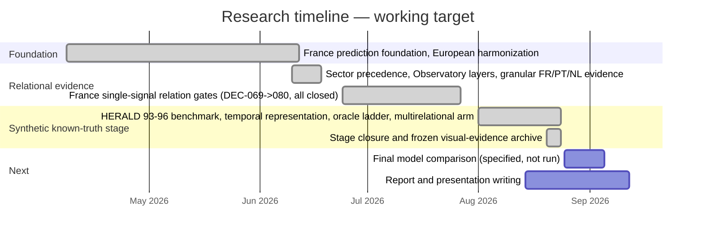

# Neural Temporal–Relational Model — French territorial economic intelligence

A frugal, auditable temporal-relational architecture for territorial economic forecasting and
relation identification, applied to France's 280 employment zones (ZE2020) and validated
against a synthetic known-truth benchmark.

**Internal historical codename:** HERALD. It appears in job directories, historical filenames,
and the decision log for traceability, but it is not this project's public/scientific name —
see [`docs/EXPERIMENT_PROVENANCE.md`](docs/EXPERIMENT_PROVENANCE.md) for the full naming map.

## Scientific question

Do several French economic signals, and the candidate territorial relations built from them,
carry identifiable relational information beyond what each territory's own temporal trajectory
already provides — and can that relational information be recovered by a learned model, as
opposed to merely improving prediction?

The project answers this in two structurally separate parts, on two structurally separate
datasets:

1. **Forecasting** — does a causal temporal representation, and does added relational
   information, improve one-step-ahead prediction?
2. **Relation identification** — does a learned graph correspond to the true relational
   structure, measured only where a true structure is actually known (a synthetic benchmark
   calibrated to French statistics — France itself has no known relational ground truth)?

Full framing: [`docs/PROJECT_OVERVIEW.md`](docs/PROJECT_OVERVIEW.md).

## Approach, in brief

- **Data:** five official French economic signals (Urssaf employment/payroll/establishments,
  Insee unemployment, Sirene/SIDE new establishments), 280 employment zones, 1998–2025
  depending on the source. [`docs/DATA_AND_PROVENANCE.md`](docs/DATA_AND_PROVENANCE.md).
- **Nodes:** territories (French employment zones, or 280 calibrated synthetic zones in the
  benchmark).
- **Candidate relations:** observed commuting flows, constructed economic similarity,
  constructed economic complementarity, and an all-pairs diagnostic — never presented as
  discovered relations. [`docs/PROJECT_OVERVIEW.md`](docs/PROJECT_OVERVIEW.md).
- **Model:** a causal temporal representation of each territory's own trajectory (local
  trajectory first), combined with a model that *learns* a graph over the candidate relations
  (territorial context second), compared against persistence, graphical Granger (Lasso), Neural
  Relational Inference, and MTGNN under one shared protocol.
- **Evaluation:** forecasting and relation recovery are scored separately, each against its own
  correct baseline (persistence for forecasting; the candidate set's own random baseline,
  never a raw number, for recovery), with a no-relation control and an oracle run alongside
  every recovery result.

## Repository structure

```text
dataset/
├── README.md                    — you are here
├── requirements.txt              — Python dependencies (pip)
├── docs/                         — canonical documentation (this is the required reading path)
│   ├── PROJECT_OVERVIEW.md
│   ├── DATA_AND_PROVENANCE.md
│   ├── REPRODUCIBILITY.md
│   ├── RESULTS_AND_LIMITATIONS.md
│   └── EXPERIMENT_PROVENANCE.md
├── src/                          — active code
│   ├── data/                     — ingestion + panel/graph builders (incl. data/france_ze2020/)
│   ├── modeles/                  — models, baselines, training/evaluation (incl. modeles/france_ze2020/)
│   ├── analyse/, visualisation/  — narrow-purpose analysis/plotting
├── scripts/                       — small entrypoint wrappers (e.g. run_minimal_example.sh)
├── tests/                        — one suite per decision/phase/dashboard version
├── data/                         — raw (mostly gitignored) / interim / processed panels — see docs/DATA_AND_PROVENANCE.md
├── hpc/                          — SLURM job scripts, active and historical (check the phase name against the decision log)
├── hpc_results/                  — raw job outputs, mostly historical/superseded — see docs/EXPERIMENT_PROVENANCE.md
├── reports/                      — the deep scientific record
│   ├── canonical/                 — 97 numbered phase/spec/result documents (provenance, not the entry point)
│   ├── final_visual_evidence/     — frozen figures/tables used by the report and presentation (do not edit)
│   ├── results_evidence_selection/— curated evidence selection for the report's Results section (do not edit)
│   ├── dashboards/, bibliography/
│   └── HERALD_METHODOLOGICAL_DECISION_LOG.md — every decision, DEC-001→146+
└── metadata/                     — older per-country data catalogs
```

`src/modeles/` keeps its French spelling (not renamed to `src/models/`) — the rename would touch
~180 tracked files' imports for no functional gain and was judged out of scope this close to
delivery.

`reports/final_visual_evidence/` and `reports/results_evidence_selection/` are **frozen
dependencies of the report and presentation** (`Pesquisa_stage/report_present/`, outside this
repository) — do not move, rename, or regenerate their contents as part of routine work here.

No `LICENSE` file exists yet. Add one before any distribution outside the project team.

## Installation

```bash
python3 -m venv .venv
source .venv/bin/activate
pip install -r requirements.txt
```

`torch` is optional (commented out in `requirements.txt`) — only needed for the
`src/modeles/synthetic/`/`real_world/` research track. See
[`docs/REPRODUCIBILITY.md`](docs/REPRODUCIBILITY.md) for details, including what was verified
during this cleanup (2826 tests collected with 0 import errors).

## Minimal run

```bash
./scripts/run_minimal_example.sh   # 12 passed, runs entirely on committed data, no download/HPC
```

This runs the persistence + Ridge(lag-only) baselines on the canonical France ZE2020 panel — the
smallest path that exercises real code on real committed data, without a download or HPC job.
Full reproduction path, fast test suites, and what needs the cluster:
[`docs/REPRODUCIBILITY.md`](docs/REPRODUCIBILITY.md).

## Main results, with their correct scope

All numbers below are on the **synthetic known-truth benchmark** unless stated otherwise — see
[`docs/RESULTS_AND_LIMITATIONS.md`](docs/RESULTS_AND_LIMITATIONS.md) for the complete, audited
account, including exact figures/tables and the language rules that govern how each result may
be described.

- A causal temporal representation of a territory's own trajectory reduces out-of-sample squared
  error by **11–24%** against the best single attribute, in every tested scenario including the
  one with no relational mechanism.
- No evaluated method — including the proposed model — clearly beats a persistence baseline on
  one-step-ahead forecasting (best skill: +0.0001).
- The relational mechanism **is observable** in the data: an oracle that receives it directly
  returns exactly zero without it and rises monotonically with its intensity.
- **No evaluated method recovers the true relational connections above chance**, under any
  tested candidate set, including a diagnostic candidate set containing every possible
  connection — which shows the bottleneck is identification, not candidate generation.
- The proposed model's apparent recovery margin is disqualified by its own no-relation control.

## Limitations (short version)

- Relation recovery has **not** been demonstrated by any tested method, on the only dataset
  where it can currently be measured (the synthetic benchmark).
- France has **no known relational ground truth** — French candidate relations are constructed
  hypotheses, never validated findings, never causal claims, never a basis for territorial
  recommendation.
- Attention-based relational fusion and relation-family-specific representations are **future
  work**, not implemented.
- No frugality claim is made or supported.

Full account: [`docs/RESULTS_AND_LIMITATIONS.md`](docs/RESULTS_AND_LIMITATIONS.md).

## Canonical documentation

1. [`docs/PROJECT_OVERVIEW.md`](docs/PROJECT_OVERVIEW.md) — territorial object, signals, nodes,
   candidate relations, temporal representation, relational learner, French-vs-synthetic split.
2. [`docs/DATA_AND_PROVENANCE.md`](docs/DATA_AND_PROVENANCE.md) — sources, periods, unit,
   transformations, synthetic data, what is and isn't versioned.
3. [`docs/REPRODUCIBILITY.md`](docs/REPRODUCIBILITY.md) — environment, install, minimal example,
   fast/full test commands, seeds, local vs. HPC.
4. [`docs/RESULTS_AND_LIMITATIONS.md`](docs/RESULTS_AND_LIMITATIONS.md) — every audited result,
   its evidence type, and the authorised/prohibited language for describing it.
5. [`docs/EXPERIMENT_PROVENANCE.md`](docs/EXPERIMENT_PROVENANCE.md) — historical phases → final
   result, the HERALD naming map, key jobs/commits, and what was discarded and why.

These five documents plus this README are the intended reading path. `reports/` holds the full
underlying record — canonical phase documents, the decision log, and the artifact registry — for
provenance and deep audit, not as a required starting point.

## Research timeline



Full detail: [`docs/EXPERIMENT_PROVENANCE.md`](docs/EXPERIMENT_PROVENANCE.md).
