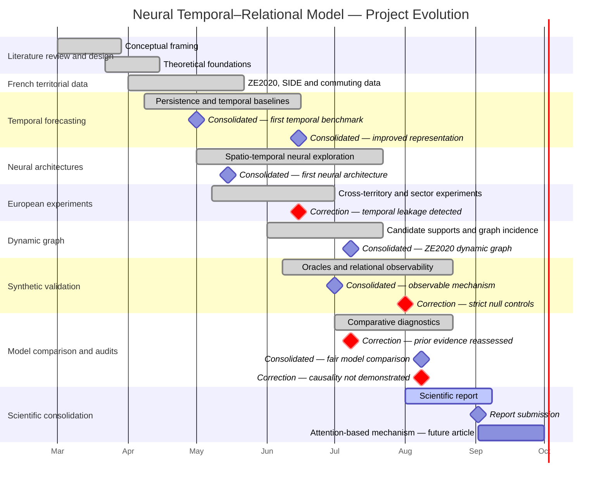

# Neural Temporal–Relational Model — French territorial economic intelligence

An auditable temporal-relational architecture for territorial economic forecasting and relation
identification, applied to France's 280 employment zones (ZE2020) and validated against a
synthetic known-truth benchmark.

**Contents:** [Scientific question](#scientific-question) ·
[Approach](#approach-in-brief) ·
[Repository structure](#repository-structure) ·
[Installation](#installation) ·
[Minimal run](#minimal-run) ·
[Main results](#main-results-with-their-correct-scope) ·
[Limitations](#limitations-short-version) ·
[Canonical documentation](#canonical-documentation) ·
[Timeline](#project-timeline-and-milestones)

## Scientific question

Do several French economic signals, and the candidate territorial relations built from them,
carry identifiable relational information beyond what each territory's own temporal trajectory
already provides — and can that relational information be recovered by a learned model, as
opposed to merely improving prediction?

The project answers this in two structurally separate parts, on two structurally separate
datasets:

1. **Forecasting** — does a causal temporal representation, and does added relational
   information, improve prediction?
2. **Relation identification** — does a learned graph correspond to the true relational
   structure, measured only where a true structure is actually known (a synthetic benchmark
   calibrated to French statistics — France itself has no known relational ground truth)?

Full framing: [`docs/PROJECT_OVERVIEW.md`](docs/PROJECT_OVERVIEW.md).

## Approach, in brief

- **Data:** five official French economic signals (private salaried employment, gross payroll,
  employer establishments — Urssaf; localised unemployment — Insee; establishment creations —
  Insee/SIDE), 280 employment zones. [`docs/DATA_AND_PROVENANCE.md`](docs/DATA_AND_PROVENANCE.md).
- **Nodes:** territories (French employment zones, or calibrated synthetic zones in the
  known-truth protocols).
- **Candidate relations:** observed commuting flows, constructed economic similarity,
  constructed economic complementarity, and an all-pairs diagnostic (in one of the two
  synthetic protocols only) — never presented as discovered relations.
  [`docs/PROJECT_OVERVIEW.md`](docs/PROJECT_OVERVIEW.md).
- **Model:** a causal temporal representation of each territory's own trajectory (local
  trajectory first), combined with a model that *learns* a graph over the candidate relations
  (territorial context second).
- **Evaluation:** run under **two separate, non-comparable synthetic protocols** (a 280-territory
  main benchmark and an 80-territory residual diagnostic — see
  [`docs/RESULTS_AND_LIMITATIONS.md`](docs/RESULTS_AND_LIMITATIONS.md)), with forecasting and
  relation recovery scored separately, each against its own correct baseline, a no-relation
  control, and an oracle.

## Repository structure

```text
./
├── README.md                    — you are here
├── requirements.txt              — data + baselines dependencies (pip)
├── requirements-neural.txt       — adds the neural model's one dependency (torch, pinned ~=2.13.0)
├── environment-neural-validated.txt — exact pip-freeze snapshot of the validated environment
├── docs/                         — canonical documentation (this is the required reading path)
│   ├── PROJECT_OVERVIEW.md
│   ├── DATA_AND_PROVENANCE.md
│   ├── REPRODUCIBILITY.md
│   ├── RESULTS_AND_LIMITATIONS.md
│   └── EXPERIMENT_PROVENANCE.md
├── src/                          — active code
│   ├── data/                     — ingestion + panel/graph builders (incl. data/france_ze2020/)
│   ├── modeles/                  — models, baselines, training/evaluation (incl. modeles/france_ze2020/)
│   ├── analyse/, visualisation/  — narrow-purpose analysis/plotting
├── scripts/                       — entrypoints: run_temporal_relational_model.py (the model),
│                                     run_minimal_example.sh (data + baselines), run_model_smoke.sh
├── tests/                        — one suite per decision/phase/dashboard version
├── results/selected/              — minimal versioned provenance for reported numbers
│   └── main_benchmark/            — see docs/RESULTS_AND_LIMITATIONS.md Sec.0-3
├── data/                         — raw (mostly gitignored) / interim / processed panels — see docs/DATA_AND_PROVENANCE.md
├── hpc/                          — SLURM job scripts, active and historical (check the phase name against the decision log)
├── hpc_results/                  — raw job outputs, mostly historical/superseded — see docs/EXPERIMENT_PROVENANCE.md
├── reports/                      — the deep scientific record
│   ├── canonical/                 — phase/spec/result documents kept as final evidence or active-code dependencies (see docs/EXPERIMENT_PROVENANCE.md for what was consolidated out and why)
│   ├── final_visual_evidence/     — frozen figures/tables used by the report and presentation (do not edit)
│   ├── dashboards/, bibliography/
│   └── (decision log) — every decision, never renumbered or deleted (exact filename: see docs/EXPERIMENT_PROVENANCE.md)
└── metadata/                     — older per-country data catalogs
```

`src/modeles/` keeps its French spelling (not renamed to `src/models/`) — the rename would touch
~180 tracked files' imports for no functional gain and was judged out of scope this close to
delivery.

`reports/final_visual_evidence/` is a **frozen dependency of the report and presentation** and
must not be moved, renamed, or regenerated as part of routine work here. A separate curated
evidence-selection workspace exists only in the author's report worktree and is not versioned in
this delivery branch; the report uses its own local copies rather than reading that workspace at
run time. The report and presentation sources are also outside this repository.

**License:** none has been chosen yet. This repository is intended for academic evaluation; its
distribution policy is still to be defined by the author. Do not treat the absence of a license
file as permission to redistribute.

## Installation

```bash
python3 -m venv .venv
source .venv/bin/activate
pip install -r requirements.txt          # data prep + persistence/Ridge baselines
pip install -r requirements-neural.txt   # add this for the neural model (torch, pinned ~=2.13.0)
```

`requirements.txt` alone is enough for `run_minimal_example.sh`. `run_model_smoke.sh` and
`run_temporal_relational_model.py` need `requirements-neural.txt` — `torch` there is capped at
the exact line this branch's own smoke was validated against, not left to install an
unvalidated future release. For the precise, fully-pinned environment that validation actually
ran in, use `environment-neural-validated.txt` instead. See
[`docs/REPRODUCIBILITY.md`](docs/REPRODUCIBILITY.md) for what was actually verified in each
environment, the cluster's own recorded dependency versions, and the full validation record.

## Minimal run

Two small, fast, local commands — neither reproduces the frozen HPC results in
[`docs/RESULTS_AND_LIMITATIONS.md`](docs/RESULTS_AND_LIMITATIONS.md) by itself; see
[`docs/REPRODUCIBILITY.md`](docs/REPRODUCIBILITY.md) for that separately-documented path.

```bash
./scripts/run_minimal_example.sh   # data + baselines: persistence and Ridge on committed data
./scripts/run_model_smoke.sh       # the neural architecture: temporal encoder + relational
                                    # learner actually run, trained, and gradient-checked on CPU
```

`run_minimal_example.sh` validates that the data pipeline and the non-neural baselines work — it
never touches the neural model. `run_model_smoke.sh` validates that the proposed neural
architecture itself runs: it trains a real (small) instance on CPU in a couple of minutes,
checks every component receives a nonzero gradient, checks the no-mechanism control does not
explode, and checks the run is deterministic.

The smoke script reports **technical execution and scientific recovery separately, and never
mixes them**: `TECHNICAL_EXECUTION` (does the architecture run, train, and produce real,
deterministic gradients — always expected to pass) is distinct from `SCIENTIFIC_RECOVERY_GATE`
(does the relational scorer keep learning under extended training). This gate is a small,
environment-sensitive diagnostic, not a fixed universal result: it has been observed to FAIL in
the validated local environment this repository documents (`environment-neural-validated.txt`),
reproducing in miniature the same disqualification `docs/RESULTS_AND_LIMITATIONS.md` Sec.3
reports at full scale, and to PASS under a newer, unvalidated PyTorch build. Either outcome is
reported as-is and neither fails the script or counts as a bug — only a `TECHNICAL_EXECUTION`
failure would. The scientific conclusion in `docs/RESULTS_AND_LIMITATIONS.md` rests on the frozen
full-scale benchmark artifacts, not on this smoke-scale diagnostic; see `docs/REPRODUCIBILITY.md`,
"Scientific recovery gate," for the full explanation.

Neither script is evidence for any result in `docs/RESULTS_AND_LIMITATIONS.md` on its own —
those come from the frozen HPC grid. The minimal necessary provenance for the main benchmark's
numbers is versioned at [`results/selected/main_benchmark/`](results/selected/main_benchmark/)
and re-derived by a dedicated test; see `docs/REPRODUCIBILITY.md`, "Reproducing the frozen
headline results."

## Main results, with their correct scope

Results come from **two separate synthetic known-truth protocols that must never be compared to
each other or presented as one** — a 280-territory main benchmark and an 80-territory residual
diagnostic. See [`docs/RESULTS_AND_LIMITATIONS.md`](docs/RESULTS_AND_LIMITATIONS.md) for the
protocol-separation table, the exact figures/tables, and the language rules that govern how each
result may be described.

- **Main benchmark (280 territories):** a causal temporal representation of a territory's own
  trajectory reduces out-of-sample squared error by 11–24% against the best single attribute, in
  every tested scenario including the one with no relational mechanism. No evaluated method —
  including the proposed model — clearly beats a persistence baseline on forecasting (best skill:
  +0.0001). No evaluated method recovers the true relational connections above the chance level
  of its own candidate set, and the proposed model's apparent recovery margin is disqualified by
  its own no-relation control.
- **Residual diagnostic (80 territories):** the relational mechanism is observable — an oracle
  that receives it directly returns a positive gain that rises with its intensity. Widening the
  candidate set to all 6,320 ordered pairs (which contains all 120 true connections) does not
  produce recovery in this implementation; this shows incomplete candidate coverage was not a
  sufficient explanation for the failure of *this* implementation, on *this* 80-territory
  diagnostic — it does not establish that candidate construction is irrelevant to every
  relational architecture or to the French application.

## Limitations (short version)

- Relation recovery has **not** been demonstrated by any tested method, under either synthetic
  protocol.
- France has **no known relational ground truth** — French candidate relations are constructed
  hypotheses, never validated findings, never causal claims, never a basis for territorial
  recommendation.
- Attention-based relational fusion and relation-family-specific representations are **future
  work**, not implemented.
- No claim is made about computational cost or efficiency; that dimension was not established as
  a final result.

Full account: [`docs/RESULTS_AND_LIMITATIONS.md`](docs/RESULTS_AND_LIMITATIONS.md).

## Canonical documentation

1. [`docs/PROJECT_OVERVIEW.md`](docs/PROJECT_OVERVIEW.md) — territorial object, signals, nodes,
   candidate relations, temporal representation, relational learner, French-vs-synthetic split.
2. [`docs/DATA_AND_PROVENANCE.md`](docs/DATA_AND_PROVENANCE.md) — sources, periods, unit,
   transformations, synthetic data, what is and isn't versioned.
3. [`docs/REPRODUCIBILITY.md`](docs/REPRODUCIBILITY.md) — environment, install, minimal example,
   fast/full test commands, seeds, local vs. HPC, and this delivery's validation record.
4. [`docs/RESULTS_AND_LIMITATIONS.md`](docs/RESULTS_AND_LIMITATIONS.md) — every audited result,
   its protocol and evidence type, and the authorised/prohibited language for describing it.
5. [`docs/EXPERIMENT_PROVENANCE.md`](docs/EXPERIMENT_PROVENANCE.md) — historical phases → final
   result, the project's naming history, key jobs/commits, and what was discarded and why.

These five documents plus this README are the intended reading path. `reports/` holds the
underlying record — the decision log, the artifact registry, and the subset of phase/spec
documents still needed as final evidence or as an active script's cited specification — for
provenance and deep audit, not as a required starting point.

## Project timeline and milestones

The timeline below mirrors the project evolution presented in the report, from the initial
framing in March to the final consolidation in September. Green milestones in the report denote
consolidated results, while orange milestones identify corrections or limitations that redirected
the subsequent work. The Mermaid version preserves that distinction through explicit
`Consolidated` and `Correction` labels. Repository evidence begins on 8 April 2026, so the March
segment records the conceptual work that preceded the first commit rather than claiming Git
evidence for that period.



Detailed, dated Git and experiment provenance is available in
[`docs/EXPERIMENT_PROVENANCE.md`](docs/EXPERIMENT_PROVENANCE.md).
