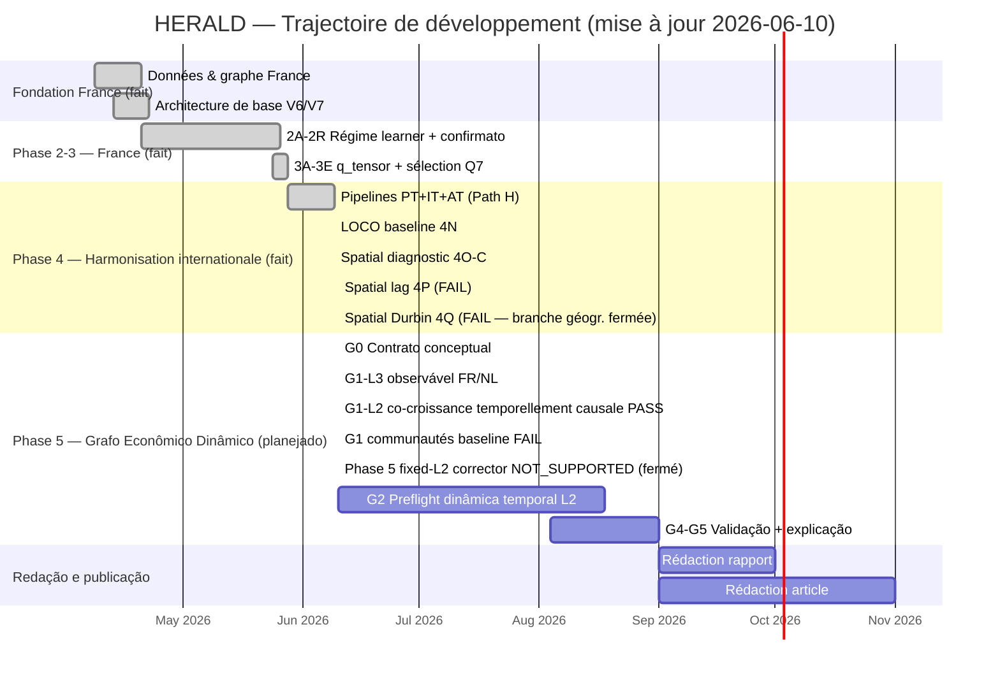

# HERALD — Prévision économique territoriale

**HERALD** (*Heterogeneous Economic Relational Adaptive Learning for territorial Dynamics*) est un modèle hybride de prévision territoriale. Il estime les créations d'établissements par zone d'emploi, produit des cartes de dynamisme, ralentissement et structure sectorielle, et apprend les régimes économiques (choc, rebond, tendance) sans flags manuelles.

---

## Trajectoire du projet

> **Mise à jour 2026-06-10 :** Le plan Gantt ci-dessous reflète l'état à jour. Le Gantt détaillé avec toutes les tâches, dépendances, risques et critères de conclusion est dans `reports/HERALD_RESEARCH_GANTT.md`.



---

## État scientifique actuel

**Candidat France:** `Q7_effectifs_lag1` — sélectionné en Phase 3E (240 runs, 12 configs × 20 seeds).

| Métrique | Valeur |
|----------|--------|
| Mean WMAPE 2021-2025 | 0.020398 |
| Std WMAPE | 0.001498 (le plus stable) |
| WMAPE 2025 | 0.011415 |
| Sector WMAPE (A10) | 0.15612 |

**Comparaison principale dashboard:**

| Modèle | Mean WMAPE | WMAPE 2025 |
|--------|-----------|------------|
| **HERALD no flags Q7** ← candidat | 0.0204 | 0.0114 |
| HERALD no flags clean (Phase 2J) | 0.0209 | 0.0122 |
| HERALD flags clean (Phase 2J) | 0.0282 | 0.0129 |
| Ridge AR | 0.0361 | 0.0361 |

**Verdicts clés Phase 3E:**
- q_tensor réel vs zéro: Δ = 0.0001, p = 0.52 — **non indispensable globalement**
- effectifs > masse salariale: Δ = 0.0004, direction consistante
- lag1 > contemporain: Δ = 0.0003, 13/20 seeds gagnantes
- Sinal local ZE (spatial falsification): modéré — non robuste sur Q7 vs permutation spatiale

---

## Architecture

HERALD combine:

1. **Graphe territorial** — zones d'emploi connectées par mobilité domicile-travail et adjacence géographique (`gamma_geo`, `gamma_mob` appris)
2. **Régime learner** — état latent continu qui module l'arbitrage local/graphe sans flags manuelles (`alpha_by_year` appris)
3. **q_tensor URSSAF** — structure locale du marché du travail (effectifs × secteur × lag temporel)
4. **Semi-supervision sectorielle** — objectif A10 auxiliaire pour régulariser la structure sectorielle

**Entrées candidat Q7:**
- `side_lag_1` — créations d'établissements année précédente
- `growth_1y` — taux de croissance YoY
- `effectifs_lag1` — employés URSSAF avec lag 1 an, par secteur A10 × ZE

---

## Généralisation internationale (Phase 4E — painel européen causal)

> **⚠️ Note critique — leakage temporel Phase 4A/4D (2026-06-03)**
>
> Les batteries Phase 4A et Phase 4D calculaient `growth_1y[t] = (y[t] − y[t-1]) / y[t-1]`,
> ce qui utilise l'objectif courant `y[t]`. Les WMAPE correspondants sont **invalides comme
> baseline scientifique**. Phase 4E corrige cela avec `growth_1y[t] = (y[t-1] − y[t-2]) / y[t-2]`
> (données passées uniquement). Voir `reports/HERALD_PHASE4E_A2_DEGRADATION_AUDIT.md`.
>
> **Baseline causal actuel : Phase 4E-B (par pays — feature-policy ablation 180 runs).**

### Résultats Phase 4E-B (baseline causal final, 10 seeds par pays)

| Pays | Baseline limpo | WMAPE | Config | Interprétation |
|------|---------------|-------|--------|---------------|
| FR | `b2_side2_zero` | 0.1031 ± 0.0084 | lag1 + causal growth1, zero tensor | modèle simple gagne |
| NL | `b0_baseline_annual` | 0.1017 ± 0.0075 | historique complet 5 features | historique complet gagne; side2 dégrade (+25%) |
| BE | `b3_current_clean_zero` | 0.1488 ± 0.0063 | current_clean, zero tensor | current_clean gagne; side2 dégrade |
| PT | `b5_side2_emp_lag1` | 0.2286 ± 0.0148 | lag1 + growth1 + tensor emploi | tensor Eurostat/ARDECO gagne |

Phase 4E-C doit comparer contre ces vencedores par pays — pas contre Phase 4E-A.  
Phase 4A/4D : référence historique uniquement — **affectées par fuite temporelle sur `growth_1y`**.

<details>
<summary>Résultats intermédiaires Phase 4E-A/A2 (historique)</summary>

| Pays | Phase 4E-A (n=10) | Phase 4E-A2 (n=10) | Config A2 |
|------|-------------------|---------------------|-----------|
| FR | 0.117044 ± 0.004437 | 0.103189 ± 0.008034 | fr_side2 |
| NL | 0.103570 ± 0.008227 | 0.102759 ± 0.006983 | current_clean + zero |
| BE | 0.154536 ± 0.008184 | 0.162253 ± 0.008524 | side5_lag1_growth1y + zero |
| PT | 0.246521 ± 0.013689 | 0.234945 ± 0.009427 | side5_lag1_growth1y + effectifs_lag1 |

</details>

### Sources de données internationales

| Composant | France | Belgique | Pays-Bas | Portugal |
|-----------|--------|---------|---------|---------|
| Créations entreprises | SIDE/SIRENE | Statbel TVA primo-assujettissements | CBS 83631NED | INE 0009702 |
| Effectifs (Q-tensor) | URSSAF effectifs | ONSS localunit Q4 | CBS 83582NED | Eurostat `nama_10r_3empers` + ARDECO SNETZ 2024 |
| Stock entreprises | SIDE | Statbel TVA | CBS 81578NED | INE 0009819 |
| Territoire | 306 ZE | **42** arrondissements | 40 COROP | **25 NUTS3** |
| Secteur | NAF Rev.2 | NACE-BEL → A10 | SBI 2008 → A10 | CAE Rev.3 → A10 |
| Fenêtre Phase 4E | 2012–2024 | 2007–2024 | 2015–2025 | 2008–2024 |
| Preflight | ✅ | ✅ | ✅ | ✅ (tensor framing ⚠️) |

Voir `reports/HERALD_PHASE4_INTERNATIONAL_PLAN.md` et `reports/HERALD_EUROPEAN_PANEL_STANDARD_PLAN.md`.

---

### Phase 4L/4M — sous-panel harmonisé `enterprise_birth`

Le Path H partiel compare uniquement des cibles démographiques
`enterprise_birth` équivalentes et un périmètre territorial déclaré
`continental_mainland`. Les panels nationaux complets restent inchangés.

| Pays | Régions retenues | Fenêtre | Statut |
|---|---:|---:|---|
| Portugal | 23 NUTS3 continentales | 2008–2020 | intégré |
| Italie | 93 NUTS3 continentales | 2008–2020 | intégré |
| Autriche | 35 NUTS3 continentales | 2008–2020 | intégré |

Açores, Madère, Sicile et Sardaigne sont exclus du sous-panel harmonisé, sans
fusion ni imputation. Ce choix contrôle la discontinuité territoriale; il ne
signifie pas que ces territoires sont hors d'Europe ou que leurs données sont
de moindre qualité. Voir
`reports/HERALD_PHASE4M_COMMON_FEATURE_CONTRACT.md` et
`reports/HERALD_PHASE4M_THIRD_COUNTRY_PREFLIGHT.md`.

Le panel conceptuellement harmonisé contient **151 NUTS3, 1 963 lignes et
3 pays**. Il est prêt pour la conception du benchmark LOCO, pas encore pour un
claim de généralisation.

Phases 4N→4Q ont ensuite exécuté le LOCO baseline, le diagnostic spatial et deux
ablations géographiques. Résultats ci-dessous.

---

## État scientifique actuel — Phase 4 (généralisation LOCO 4 pays)

> Phase 4G/4H/4I étend le painel européen à un protocole **leave-one-country-out**
> (FR, NL, BE, PT). Cette section reflète l'état validé après les audits 4H-B et
> 4I-A et l'audit indépendant du prochain pas. **Elle supersède, pour le claim de
> généralisation, les chiffres antérieurs des phases 4A/4D (affectées par fuite).**

### Protocole (à énoncer précisément)

Le protocole est un **LOCO « parameter zero-shot avec historique du pays-cible
disponible »** : le pays exclu ne participe pas à l'ajustement (Ridge, préproc,
loss neuronale), mais ses **lags historiques** et ses écarts-types par zone
proviennent de son propre passé à l'inférence. **Ce n'est pas un cold-start
complet** — distinction établie dans `HERALD_PHASE4H_CODE_CONCEPT_AUDIT_2026.md`.

### Résultats valides (4 pays, horizon 1 an, métrique WMAPE annuelle balancée par pays)

| Modèle | WMAPE balancé 4 pays | Statut |
|--------|----------------------|--------|
| Persistance (last value) | **~0.0939** | meilleur baseline balancé |
| Ridge non pondéré | ~0.0969 | meilleur modèle entraînable |
| Graphe réel / résiduel neuronal / sélection par compatibilité | ≥ Ridge | ne transfère pas robustement |

- Le **graphe réel ne dépasse pas consistamment** l'identité ni le graphe permuté
  (BE : petit gain, non significatif).
- Le **résiduel neuronal** et la **sélection par compatibilité de descripteurs**
  ne transfèrent pas robustement dans ce protocole (compat. améliore NL/PT mais
  dégrade FR +113 % et BE +27 %).

### Limites du claim (à respecter)

- Claim **conditionnel valide** : « la méthode actuelle ne transfère pas
  robustement sur **ces 4 pays et ce protocole** ».
- Claim **universel interdit** : ceci **ne prouve pas** que graphes ou résiduels
  ne fonctionnent **jamais** sur d'autres pays ou protocoles (n=4 domaines, pas de
  puissance statistique ; les seeds ne sont pas des pays indépendants).
- L'**avantage de la persistance est dépendant de l'horizon d'un an** — non
  testé au-delà.

### Géométries et targets hétérogènes (fait confirmé par les adapters)

| Pays | Géométrie | Target (concept national) |
|------|-----------|---------------------------|
| FR | ZE2020 | créations d'établissements (SIDE/SIRENE) |
| NL | COROP | oprichtingen van vestigingen (CBS 83631NED, unité locale) |
| BE | arrondissements | primo-assujettissements TVA (StatBel) |
| PT | NUTS3 | naissances d'entreprises INE (0009702/0014098) |

Le painel **mélange 4 systèmes spatiaux** (pas du NUTS3 homogène → exposé au
*Modifiable Areal Unit Problem*) et **plusieurs concepts de target dont l'équivalence
sémantique n'est pas établie documentalement**. Ne pas présenter ces targets
comme équivalents.

### Décision méthodologique actuelle

**Ne pas étendre les pays ni augmenter l'architecture.** Phase 4J a exécuté les
deux gates :

1. **Gate sémantique : FAIL pour un target unique harmonisé.** FR/NL mesurent des
   unités locales avec des règles différentes, BE une première inscription TVA,
   PT des naissances d'entreprises INE. Le panneau actuel reste utilisable comme
   benchmark de transfert entre tâches hétérogènes, pas comme preuve de
   généralisation d'un target identique.
2. **Gate combinaison agrégé : PASS, promotion finale : en attente.** La moyenne
   fixe `0.5 × persistance + 0.5 × Ridge` réduit le WMAPE balancé de `0.093912` à
   `0.087067` (-7.29 %) et améliore la moyenne dans les 4 pays. Mais elle dégrade
   fortement certaines pires années; les poids appris sur pays-source ne
   transfèrent pas de façon sûre.

Les intervalles conformes rolling restent exploratoires: couverture raisonnable,
mais largeur élevée en FR/PT. Prochaine décision: construire un nouveau target
européen harmonisé, ou formaliser le problème comme transfert multi-tâche à
targets explicitement hétérogènes.

### Rapports principaux

- `reports/HERALD_PHASE4_NEXT_STEP_INDEPENDENT_AUDIT.md` — audit indépendant, matrice de décision, gates
- `reports/HERALD_PHASE4J_A_FORECAST_COMBINATION_AUDIT.md` — combinaison, stabilité et incertitude
- `reports/HERALD_PHASE4J_SEMANTIC_TARGET_AUDIT.md` — audit officiel des concepts de target
- `reports/HERALD_PHASE4H_B_RESULTS_AUDIT.md` — résultats LOCO corrigés (graphe réel, contrôle permutation)
- `reports/HERALD_PHASE4I_A_RESULTS_AUDIT.md` — benchmark de transfert sélectif (persistance vs Ridge vs graphe)
- `reports/HERALD_PHASE4H_CODE_CONCEPT_AUDIT_2026.md` — audit code/concept, définition du protocole

---

## Phase 4N–4Q — Baseline LOCO harmonisé et branche géographique (2026-06-10)

> **Branche graphe géographique FERMÉE sous les données actuelles.**

### Phase 4N — LOCO Baseline (PT/IT/AT)

| Country | persistence | n3_residual | n2_ridge_direct |
|---|---:|---:|---:|
| PT | 0.1321 | **0.1166** | 0.1596 |
| IT | **0.0549** | 0.0607 | 0.1246 |
| AT | **0.0753** | 0.0823 | 0.3021 |
| **Balancé** | **0.0874** | **0.0865** | 0.1954 |

Verdict : **persistance = meilleur baseline balancé**. n3 améliore PT uniquement (1/3) — non promu.

### Phase 4O-C — Diagnostic spatial résiduel

- IT : **PASS** — Moran's I robuste (résidus relatifs + causaux, 7/9 ans significatifs, LOO stable).
- PT : **FAIL** — LOO instable (signal concentré dans quelques provinces).
- AT : **FAIL** — signal uniquement dans résidus absolus (hétéroscédasticité probable).
- **Gate multi-pays Phase 4P : NON autorisé (1/3 pays).**

### Phase 4P — Spatial Lag Italy (FAIL)

`W × births[t-1]` (queen-contiguity) : WMAPE réel 0.05619 vs persistence 0.05495 (+2.26%). p=0.19 (18/99 contrôles égalent ou battent le graphe réel). **Rejeté.**

### Phase 4Q — Spatial Durbin Italy (FAIL)

Bloc Spatial-Durbin fixe (moyennes voisins de tous les covariables communs) : WMAPE 0.05821 vs persistence 0.05495 (−5.95%). p=0.32. **Rejeté.**

**Conclusion : branche graphe géographique (queen-contiguité linéaire) fermée sous les données 2008–2020. Ne pas lancer STGNN, HERALD multi-pays ou Phase 4P multi-pays.**

- `reports/HERALD_PHASE4N_RESULTS_AUDIT.md`
- `reports/HERALD_PHASE4O_B_RESIDUAL_SPATIAL_AUDIT.md`
- `reports/HERALD_PHASE4P_ITALY_SPATIAL_LAG_AUDIT.md`
- `reports/HERALD_PHASE4Q_ITALY_SPATIAL_DURBIN_AUDIT.md`

---

## Nouveau cap — Graphe Économique Dynamique (Bloco 2)

> **Ce n'est pas la réouverture du graphe géographique.** C'est une question scientifique différente.

La branche géographique testait si des lags de voisins améliorent la **prévision**.
Le graphe économique dynamique répond à : **quelles relations économiques secteur-territoire existent et évoluent dans le temps ?**

**Rôle du graphe :**
- Représenter les relations entre secteurs et territoires
- Suivre leur évolution annuelle (2008–2020)
- Détecter croissance, crise, stagnation, reprise
- Identifier communautés et vagues économiques
- Expliquer quelles relations sont associées aux prévisions
- Alimenter à terme la recommandation économique (Bloco 3)

**Ce que ce graphe n'est PAS encore :**
- Un composant de prévision promu
- Une preuve de causalité économique
- Un système de recommandation opérationnel

Le contrat G0 est validé (10/10). L'implémentation reste limitée aux couches
observables auditées. Voir :
- `reports/HERALD_DYNAMIC_ECONOMIC_GRAPH_ROADMAP.md` — roadmap complet G0→G6→Bloco 3
- `reports/HERALD_RESEARCH_GANTT.md` — Gantt réaliste avec DATE_LIMITE_A_CONFIRMER
- `reports/HERALD_METHODOLOGICAL_DECISION_LOG.md` — log de décisions DEC-001→DEC-028
- `reports/HERALD_EVIDENCE_MATRIX.md` — matrice de claims et statuts (32 claims, MET-06 ajouté)
- `reports/HERALD_GRAPH_TEMPORAL_ARCHITECTURE_DECISION.md` — DEC-027: preflight méthodologique
- `reports/HERALD_GRAPH_TEMPORAL_E0_V2_AUDIT.md` — DEC-028: E0_V2_PASS; schema 2.0; 57 tests
- `reports/HERALD_GRAPH_TEMPORAL_FR_ADJACENCY_PREFLIGHT.md` — FR_ADJACENCY_READY (280 ZE, 5 folds)
- `reports/HERALD_GRAPH_TEMPORAL_A1_IMPLEMENTATION_CONTRACT.md` — contrat A1 FROZEN (DEC-028)

**Visualisation (DEC-014) :**  
`reports/dashboards/herald_france_final_dashboard.html` est la **base visuelle
officielle**. Pas de nouveau dashboard from scratch. Adaptation incrémentale
seulement après validation des couches L1, L2 et L3. L3 et L2 sont maintenant
validés; ne pas modifier ce fichier ni générer un nouveau HTML avant autorisation
explicite.

**État du graphe économique dynamique (2026-06-11) :**

- **G0:** contrat formel complet, 10/10 items.
- **L3 territoire-structure:** PASS pour FR/NL (q=0.005, LOYO=True, bootstrap stable).
  PT exclu du gate 9-secteurs (KZ absent par définition INE — DEC-018).
- **L1 RCA secteur-secteur:** FAIL au gate commun (NL pass, FR fail, PT inéligible).
- **L2 co-croissance sans fuite temporelle:** PASS pour FR/NL/PT (q=0.005, LOYO=True, COVID-robuste — DEC-019).
  PT participe avec 8 secteurs. Arêtes = corrélations de co-mouvement calculées
  sans données futures, ni prédictibilité de Granger ni causalité structurelle.
- **Détection de communautés (L2):** FAIL 0/3 sous contrôles corrigés; la
  modularité est reproductible par les nulls malgré quelques signaux AMI.
- **L4 mobilité, L5 géographie:** non encore validés.
- **Phase 5 (résidu + graphe) — NOT_SUPPORTED (fermé 2026-06-10, DEC-023):**
  Ablation v3 : NL 2021-2023, 5 seeds, widths (2,)(4,)(8,)(16,8).
  Meilleur H2-neural (width=(8,)) : 5.53 % vs H0b 3.41 % — régression de 62 %.
  H2 bat les contrôles permutés (spécificité graphique ✓) mais ne bat pas H1-neural (sans graphe).
  Correcteur linéaire H2-linear : 5.56 % vs H0b 3.41 % — même conclusion.
  H0b (Ridge AR) reste la meilleure baseline. Pas de soumettre au HPC.
  65/65 tests passent. Leakage OK. Déterministe. Masques PT KZ corrects.
  Correcteur résiduel fixed-L2 fermé. L2 reste validé comme graphe analytique (G-10 SUPPORTED).
  Bloco 2 G2 preflight (2026-06-10) : résultats descriptifs valides (M2 Jaccard 0.06-0.26, turnover 59%).
  Contrôle corrigé (DEC-024c, 2026-06-11) : `build_g2_corrected_controls.py`, 199 perms N1+N2, pipeline complet.
  Sensibilité COVID (DEC-024d) : FR reste 9/9 avec et sans 2020. NL change
  4/9→5/9 et PT 4/8→0/8. Le gate 2/3 passe dans les deux scénarios mais avec
  des pays différents; seule la France est COVID_ROBUST.
  G2_EDGE_STABILITY_NOT_SUPPORTED : M2 0.06-0.26, loin du seuil 0.70. M3 null BLOCKED.

  G2 dynamique agrégée (DEC-025, 2026-06-11) : analyse descriptive terminée
  pour FR/NL/PT. Les densités changent peu; les poids moyens sont stables en
  FR, augmentent légèrement aux NL et davantage au PT. Les périodes sont des
  fenêtres mobiles de cinq ans classées par leur dernière année observée:
  «2020» signifie fenêtre terminant en 2020, disponible en 2021. G-14 est
  `SUPPORTED` uniquement comme constat descriptif calculé. Les intervalles par
  rééchantillonnage de paires ne sont pas des intervalles de confiance.
  G-13 : PARTIALLY_SUPPORTED et COVID_SENSITIVE hors FR. Portée autorisée :
  description agrégée pour tous les pays; claim inférentiel robuste uniquement pour FR.
  Interdit : claims arêtes individuelles, pooling pays, causalité, communautés, recommandation.
  Ancien contrôle (commit cc48924) INVALIDE : permutait des poids pré-calculés. Ne pas citer p=0.005.

  Préflight architecture graphe-temporelle (DEC-027, 2026-06-11) :
  EconoGNN est une référence méthodologique, pas une base réutilisable.
  A0 reste AR/Ridge. Les candidats A1 sont GConvGRU et EvolveGCN-H à faible
  capacité, avec la même cible territoriale et des graphes L2 causaux par
  fenêtre.

  **DEC-028 (2026-06-11) — FERMÉ :**
  - **E0_V2_PASS** : schema 2.0 corrige 5 défauts du schema 1.0 (séquences temporelles,
    Ridge canonique, masques par feature, positive_topk, RSS mémoire). 13.92s, 0.035 GB,
    57/57 tests, déterministe, zéro fuite. Artefacts : `data/processed/graph_temporal_v2/`.
  - **FR_ADJACENCY_READY** : 280 ZE, 9 secteurs, 5 années d'évaluation (2021–2025),
    0 nœuds isolés à k=3/5/10, 1 composante connexe, symétrie parfaite, 8 critères
    fail-closed OK. Tenseurs prêts pour GConvGRU/EvolveGCN-H.
  - **Contrat A1 FROZEN** : interface commune, tête résiduelle bornée (clamp_frac∈{0.10,0.15}),
    pooling masqué, ≤5 000 paramètres, 11 tests obligatoires avant S1-FR.
  - **S1_FR_BLOCKED** : bloqué jusqu'à implémentation de A1a (GConvGRU), A1b (EvolveGCN-H),
    A0-neural, et passage des 11 tests dans `tests/test_graph_temporal_a1.py`.
  - **HPC_BLOCKED** : bloqué jusqu'à passage de S1-FR en local.
  - Prochaine étape : implémenter `src/modeles/graph_temporal_models.py` + tests.

- **Phase 6 — P6_DDEG_S1 : graphe dual dynamique France — FAIL (2026-06-12) :**
  - Étude complète : job Slurm 7453691, 275/275 runs complétés (5 folds × 11 contrôles × 5 seeds).
  - Décision de gate : **DUAL_GRAPH_S1_FAIL** — les 7 critères échouent (DEC-029).
  - MAE C5_dual 0.1424 vs C1_ridge 0.1242 (+14,6%) et C2_no_graph 0.1329 (+7,2%).
  - Jaccard graine 0.3353 (seuil 0.50). Fold 2023 : régression +17,4% vs C2.
  - Branche prédictive graphe-dual **FERMÉE**. Ne pas relancer sans défaillance opérationnelle documentée.
  - Artefacts clés : `data/processed/dual_graph_s1/gate_result.json`,
    `reports/HERALD_DUAL_GRAPH_S1_RESULTS.md`, `reports/HERALD_DUAL_GRAPH_S1_FINAL_AUDIT.md`.

Voir `reports/HERALD_G1_L2_CAUSAL_COGROWTH_AUDIT.md` et
`reports/HERALD_PHASE5_HPC_SPEC.md`.

---

## Claims autorisés dans les publications

**Autorisés (avec portée déclarée) :**
- La persistance est le meilleur baseline LOCO balancé pour PT/IT/AT, enterprise birth harmonisé, 2008–2020, horizon 1 an.
- Les résidus italiens montrent une autocorrélation spatiale robuste (Moran's I, FDR, LOO-stable, 7/9 ans).
- Les lags géographiques linéaires (queen-contiguité) n'améliorent pas les prévisions sous le protocole actuel.
- FR/NL/BE/PT ont des targets sémantiquement hétérogènes ; le WMAPE poolé n'est pas une métrique de généralisation valide.
- HERALD Q7 atteint WMAPE moyen 0.0204 sur les ZE françaises 2021–2025.

**Interdits :**
- « HERALD fournit des recommandations économiques. » (module inexistant)
- « Le graphe géographique améliore les prévisions. » (réfuté sous protocole actuel)
- « Le système se généralise à tout pays européen. » (n=3–4 domaines, portée conditionnelle)
- « Le protocole LOCO est un cold-start complet. » (faux — historique du pays-cible disponible)
- « Les poids d'attention expliquent les relations économiques. » (non testé, non validé)
- « Granger-prédictabilité = causalité économique structurelle. » (interdit explicitement)

---

## Structure du dépôt

```
dataset/
├── data/           données brutes, intermédiaires et panels canoniques
├── hpc/            batteries SLURM, scripts de soumission et audits
├── hpc_results/    sorties HPC (non versionnées, régénérables)
├── reports/        rapports méthodologiques, audits et dashboards
│   └── dashboards/ herald_france_final_dashboard.html  ← base visuelle officielle
├── src/            code modèle, baselines, visualisation
└── metadata/       splits walk-forward, datasets, politiques de données
```

---

## Commandes principales

```bash
# Régénérer le dashboard France
python3 src/visualisation/generate_herald_semi_v2_dashboard.py

# Vérifier les panneaux Phase 4 (NL/BE/PT)
python3 src/data/phase4_preflight.py

# Lancer batterie Phase 4 (après préparation des scripts)
bash hpc/phase4/submit_herald_phase4_nl.sh
bash hpc/phase4/submit_herald_phase4_be.sh
bash hpc/phase4/submit_herald_phase4_pt.sh

# Agréger résultats France
python3 hpc/regime/aggregate_herald_regime_results.py --root hpc_results/<run_root>

# Auditer Phase 3E
python3 hpc/regime/audit_herald_phase3e_qtensor_arch_results.py \
  --root hpc_results/herald_regime_phase3e_qtensor_arch_20260527_173259_r1
```

---

## Documents clés

**Phase 3E (sélection architecture q_tensor):**
- `reports/HERALD_PHASE3E_QTENSOR_ARCH_AUDIT.md` — verdict Q7

**Phase 2R (confirmatoire France):**
- `reports/HERALD_PHASE2R_CONFIRMATORY_AUDIT.md`
- `reports/HERALD_CURRENT_MODEL_DECISION_20260527.md`

**Phase 4E (généralisation internationale — painel européen causal):**
- `reports/HERALD_PHASE4E_B_RESULTS_AUDIT.md` — **baseline causal final par pays (Phase 4E-B)**
- `reports/HERALD_PHASE4E_B_FEATURE_POLICY_PLAN.md` — design de la feature-policy ablation
- `reports/HERALD_PHASE4E_A2_DEGRADATION_AUDIT.md` — audit leakage Phase 4A + historique 4E-A/A2
- `reports/HERALD_EUROPEAN_PANEL_STANDARD_PLAN.md` — architecture du painel européen standardisé
- `src/data/european_panel/build_european_panel.py` — pipeline causal (enforce_causal_growth)
- `src/data/european_panel/validation.py` — garde causale automatique sur growth_1y/2y
- `hpc/phase4/` — batteries HPC Phase 4E-A/A2/B complètes

**Phase 4G/4H/4I/4J (généralisation LOCO 4 pays — état scientifique actuel):**
- `reports/HERALD_PHASE4_NEXT_STEP_INDEPENDENT_AUDIT.md` — audit indépendant + gates de décision
- `reports/HERALD_PHASE4J_A_FORECAST_COMBINATION_AUDIT.md` — combinaison 50/50 (candidate), stabilité, conformal exploratoire
- `reports/HERALD_PHASE4J_SEMANTIC_TARGET_AUDIT.md` — audit officiel des targets (gate sémantique : FAIL, Path H/M)
- `reports/HERALD_PHASE4J_TARGET_EQUIVALENCE_TABLE.md` — table canonique des 4 targets (PT gate fermé : Eurostat total enterprise births)
- `reports/HERALD_PHASE4J_PATH_M_PROTOCOL.md` — protocole transfert multi-tâche à targets hétérogènes
- `reports/HERALD_PHASE4J_TARGET_AWARE_RESULTS.md` — résultats par concept + tail-risk (50/50 : FAIL, non promu)
- `reports/HERALD_PHASE4H_B_RESULTS_AUDIT.md` — résultats LOCO corrigés
- `reports/HERALD_PHASE4I_A_RESULTS_AUDIT.md` — benchmark de transfert sélectif
- `reports/HERALD_PHASE4H_CODE_CONCEPT_AUDIT_2026.md` — audit code/concept + protocole

**Phase 4A/4D (legacy — leakage-affected, ne pas utiliser comme baseline):**
- `data/external/PHASE4_DATA_STATUS.md` — statut panneaux NL/BE/PT (pipelines anciens)
- `src/data/ingest_belgium_panel.py` — pipeline Belgique ancien (growth_1y leaky)
- `src/data/ingest_netherlands_panel.py` — pipeline Pays-Bas ancien (growth_1y leaky)
- `src/data/ingest_portugal_panel_nuts3.py` — pipeline Portugal ancien (growth_1y leaky)

**Audit intégrité:**
- `reports/HERALD_LEAK_AUDIT_FINAL_20260507.md`

**Dashboard:**
- `reports/dashboards/herald_france_dashboard.html`

---

## Règle de présentation

Pour le papier, l'application et le dashboard: **HERALD**. Les variantes internes (Q7, L5, Phase 2J, etc.) sont des configurations expérimentales qui prouvent la robustesse — pas une histoire de versions successives.
