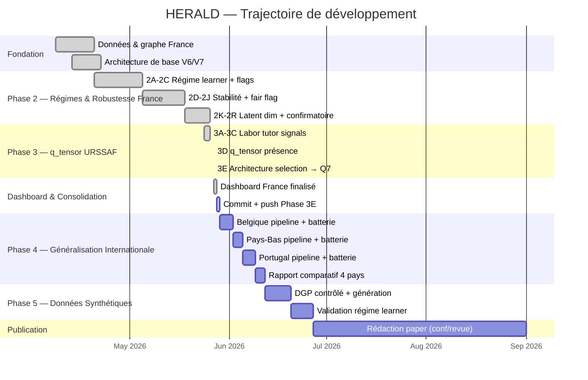

# HERALD — Prévision économique territoriale

**HERALD** (*Heterogeneous Economic Relational Adaptive Learning for territorial Dynamics*) est un modèle hybride de prévision territoriale. Il estime les créations d'établissements par zone d'emploi, produit des cartes de dynamisme, ralentissement et structure sectorielle, et apprend les régimes économiques (choc, rebond, tendance) sans flags manuelles.

---

## Trajectoire du projet



---

## État scientifique actuel

**Candidat France:** `Q7_effectifs_lag1` — sélectionné en Phase 3E (240 runs, 12 configs × 20 seeds).

| Métrique | Valeur |
|----------|--------|
| Mean WMAPE 2021-2025 | 0.020398 |
| Std WMAPE | 0.001498 (le plus stable) |
| WMAPE 2025 | 0.011415 |
| Sector WMAPE (A10) | 0.15612 |

**Comparaison principale dashboard:**

| Modèle | Mean WMAPE | WMAPE 2025 |
|--------|-----------|------------|
| **HERALD no flags Q7** ← candidat | 0.0204 | 0.0114 |
| HERALD no flags clean (Phase 2J) | 0.0209 | 0.0122 |
| HERALD flags clean (Phase 2J) | 0.0282 | 0.0129 |
| Ridge AR | 0.0361 | 0.0361 |

**Verdicts clés Phase 3E:**
- q_tensor réel vs zéro: Δ = 0.0001, p = 0.52 — **non indispensable globalement**
- effectifs > masse salariale: Δ = 0.0004, direction consistante
- lag1 > contemporain: Δ = 0.0003, 13/20 seeds gagnantes
- Sinal local ZE (spatial falsification): modéré — non robuste sur Q7 vs permutation spatiale

---

## Architecture

HERALD combine:

1. **Graphe territorial** — zones d'emploi connectées par mobilité domicile-travail et adjacence géographique (`gamma_geo`, `gamma_mob` appris)
2. **Régime learner** — état latent continu qui module l'arbitrage local/graphe sans flags manuelles (`alpha_by_year` appris)
3. **q_tensor URSSAF** — structure locale du marché du travail (effectifs × secteur × lag temporel)
4. **Semi-supervision sectorielle** — objectif A10 auxiliaire pour régulariser la structure sectorielle

**Entrées candidat Q7:**
- `side_lag_1` — créations d'établissements année précédente
- `growth_1y` — taux de croissance YoY
- `effectifs_lag1` — employés URSSAF avec lag 1 an, par secteur A10 × ZE

---

## Généralisation internationale (Phase 4)

HERALD utilise des données disponibles dans tous les pays européens avec système de sécurité sociale:

| Composant | France | Belgique | Pays-Bas | Portugal |
|-----------|--------|---------|---------|---------|
| Créations entreprises | SIDE/SIRENE | Statbel | CBS StatLine | INE |
| Effectifs | URSSAF | ONSS/NSSO | CBS werkzame | GEP Quadros de Pessoal |
| Masse salariale | URSSAF | FPB | CBS loonsom | GEP remuneração |
| Territoire | 306 ZE | 43 arrondissements | 40 COROP | 308 municípios |
| Secteur | NAF Rev.2 | NACE-BEL | SBI 2008 | CAE Rev.3 |

Voir `reports/HERALD_PHASE4_INTERNATIONAL_PLAN.md` pour le plan détaillé.

---

## Structure du dépôt

```
dataset/
├── data/           données brutes, intermédiaires et panels canoniques
├── hpc/            batteries SLURM, scripts de soumission et audits
├── hpc_results/    sorties HPC (non versionnées, régénérables)
├── reports/        rapports méthodologiques, audits et dashboards
│   └── dashboards/ herald_france_dashboard.html
├── src/            code modèle, baselines, visualisation
└── metadata/       splits walk-forward, datasets, politiques de données
```

---

## Commandes principales

```bash
# Régénérer le dashboard France
python3 src/visualisation/generate_herald_semi_v2_dashboard.py

# Lancer batterie Phase 4 Belgique
bash hpc/regime/submit_herald_phase4_belgium.sh

# Agréger résultats
python3 hpc/regime/aggregate_herald_regime_results.py --root hpc_results/<run_root>

# Auditer Phase 3E
python3 hpc/regime/audit_herald_phase3e_qtensor_arch_results.py \
  --root hpc_results/herald_regime_phase3e_qtensor_arch_20260527_173259_r1
```

---

## Documents clés

**Phase 3E (sélection architecture q_tensor):**
- `reports/HERALD_PHASE3E_QTENSOR_ARCH_AUDIT.md` — verdict Q7

**Phase 2R (confirmatoire France):**
- `reports/HERALD_PHASE2R_CONFIRMATORY_AUDIT.md`
- `reports/HERALD_CURRENT_MODEL_DECISION_20260527.md`

**Phase 4 (généralisation internationale):**
- `reports/HERALD_PHASE4_INTERNATIONAL_PLAN.md`

**Audit intégrité:**
- `reports/HERALD_LEAK_AUDIT_FINAL_20260507.md`

**Dashboard:**
- `reports/dashboards/herald_france_dashboard.html`

---

## Règle de présentation

Pour le papier, l'application et le dashboard: **HERALD**. Les variantes internes (Q7, L5, Phase 2J, etc.) sont des configurations expérimentales qui prouvent la robustesse — pas une histoire de versions successives.
