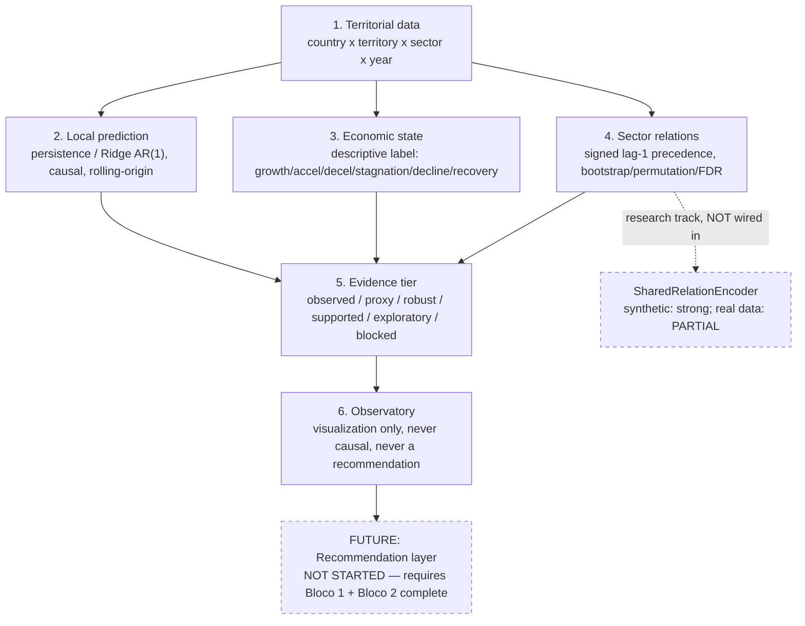

# HERALD 03 — Methods and Architecture

**Created:** 2026-06-18 (canonical consolidation pass).
**Status:** Documentation only — restates `reports/HERALD_ARCHITECTURE_OVERVIEW.md` and
`reports/HERALD_PROJECT_CHARTER.md`. If this document disagrees with either, they win.
**Represents:** `reports/HERALD_ARCHITECTURE_OVERVIEW.md`, `reports/HERALD_G0_FORMAL_CONTRACT.md`,
the Phase 5/6 graph-temporal contracts, and the DEC-048→DEC-059 neural relation-learning
research-track reports. None deleted — see `reports/HERALD_REPORTS_CONSOLIDATION_MAP.md`.

---

## 1. Architecture flowchart



This mirrors the 6-stage / 4-component diagram built into the v0.5.1 dashboard
("Méthode HERALD"). The dashed boxes are explicitly **not** part of the current
Observatory output: the neural research track is informative but unwired, and the
recommendation layer does not exist.

---

## 2. What is validated, statistical, and currently cited

| Component | Method | Validation | Status |
|---|---|---|---|
| Local prediction | Persistence (`value[t]=value[t-1]`); Ridge/AR(1) (L2-regularized linear regression on lagged features) | Causal rolling-origin, LOCO across PT/IT/AT | **VALIDATED** — best LOCO baseline (DEC-006). France Q7 richer but PENDING_REAUDIT |
| Economic states | Rule-based thresholds on observed growth rates | None needed — these are descriptive facts, not predictions | **VALIDATED** (by construction; not a model) |
| Sector→sector relations | Signed lag-1 regression + bootstrap/permutation + BH/FDR | DEC-034 (original), DEC-066 (fine-grain tiers) | **VALIDATED**, 20 observed edges (FR=9, NL COROP=8, PT Municipal=3) |
| Territorial co-growth (G1-L2) | Rolling correlation, temporal/territory permutation nulls | DEC-019/020 | **VALIDATED** (PASS, FR/NL/PT) |

No neural network appears anywhere in this validated set. Phase 7 sector precedence and
Phase 8 territorial-influence decomposition are both **linear regression arithmetic**, not
learned models.

---

## 3. What was tested and failed (closed branches)

| Branch | Method | Gate result | Decision | Reopen requires |
|---|---|---|---|---|
| Geographic/mobility graph (queen-contiguity spatial lag) | `W × births[t-1]` added to Ridge | Real graph WMAPE 0.0562 vs persistence 0.0549 (+2.26%); p=0.19 vs permuted controls | **FAIL**, CLOSED | New country/network/window + new DEC-* (Charter §8) |
| Spatial Durbin (Italy) | Bounded extension of the above | FAIL | **CLOSED** | Same as above |
| P6 Dynamic Dual Economic Graph | Learned dual graph, predictive | All 7 pre-registered gate criteria fail; C5_dual MAE 0.1424 vs C1_ridge 0.1242 (+14.6%); seed Jaccard 0.34 | `DUAL_GRAPH_S1_FAIL` (DEC-029), **CLOSED** | New hypothesis + new data |
| Graph-temporal (GConvGRU, EvolveGCN-H) | Same-target graph-temporal neural prediction | Indistinguishable from temporal/territory permutation nulls (p=1.0 for GConvGRU); WMAPE Ridge 0.06486 vs GConvGRU 0.06492 vs EvolveGCN-H 0.06497 | `S1_FR_FAIL` (DEC-031), **CLOSED** | New architecture + new DEC-* |
| Community detection (Louvain) | Static/temporal community structure on G1 | 0/3 PASS under valid nulls + modularity/AMI FDR gate | **FAIL**, CLOSED | New evidence |
| Phase 5 fixed-L2 corrector | Residual correction using L2 graph | H2-neural 5.53% vs H0b 3.41% (worse) | `NOT_SUPPORTED` (DEC-023), **CLOSED** | New hypothesis |
| RCA co-specialization (G1-L1) | Sector relatedness via RCA | NL pass, FR fail | `NOT_SUPPORTED` (DEC-017) | New evidence |

**Per Charter §8:** performance failure alone is never sufficient to reopen a closed
branch — a new DEC-* entry with new evidence and a pre-registered gate is required.

---

## 4. What is partially promising (research track, not in any dashboard)

**SharedRelationEncoder** (DEC-055 onward):
- **Synthetic data:** in-sample AUC=0.960, unseen-pair AUC=0.690 — strong, better than the
  earlier per-pair `GraphRelationHead` (OOS AUC=0.529, pure memorization).
- **Real data (DEC-056, fine-tuned with Phase 7 weak labels DEC-058/059):** sign
  concordance 0.438 (zero-shot) to ~0.667 (best fine-tuned variant) — better than chance,
  but DEC-059 found 4 of 7 negative controls within 0.05 of the best variant. No robust
  cross-country replication. COVID/window sensitivity unresolved. **Zero abstentions** in
  any run — every pair gets a score, none flagged `INSUFFICIENT_EVIDENCE` even where
  evidence is thin (a documented gap between the policy taxonomy and the implementation,
  see `reports/HERALD_NAMING_CONVENTIONS.md` §6).
- **Verdict:** `REAL_WEAK_LABEL_TUNING_PARTIAL` (DEC-059's own label). Worth continuing as
  research; **not** wired into any Observatory dashboard. The v0.5.1 dashboard explicitly
  states in its own UI text that no neural candidate-relation dataset exists in this
  repository for real data today — this is itself correct and should not be "fixed."

---

## 5. What cannot be claimed (Charter §5, restated)

- "HERALD provides economic recommendations" — module does not exist.
- "The geographic graph improves forecasts" — refuted (4P/4Q).
- "The system generalises to any European country" — n=3–4 domains, conditional scope only.
- "Attention weights explain economic relations" — not tested, not validated.
- "Granger predictability = structural economic causality" — explicitly prohibited language.
- "P6 learned sector edges represent economic structure" — sector labels in that artefact
  are `INVALID_FOR_INTERPRETATION` (wrong mapping, Charter §6).
- "Louvain communities are validated" — `NOT_SUPPORTED`.
- "Individual G2 edges are stable" — `G2_EDGE_STABILITY_NOT_SUPPORTED`.

---

## 6. What feeds the dashboard (build chain, no recomputation)

```
granular_territory_state_panel.csv  ─┐
granular_relation_edges.csv          ├─→ build_observatory_v04_dashboard.py ──→ v0.4/v0.4.1
blocked_proxy_edges.csv             ─┘

(v0.4 exports) + v0.3 forecast + pt_municipal_phase7_panel.csv (DEC-068)
  ─→ build_pt_municipal_prediction_layer.py
  ─→ build_observatory_v051_narrative_exports.py
  ─→ build_observatory_v051_narrative_dashboard.py (+ _template.py)
  ──→ v0.5.1 (current candidate)
```

Every builder consumes already-validated, already-tested exports from an earlier stage —
no dashboard builder recomputes a scientific number from raw data. This is enforced by
fail-closed asserts (e.g. "GEMEENTE_PROXY never appears in relation_edges") and
re-verified by each stage's test suite.

---

## Cross-reference

- Phase-by-phase narrative: `reports/canonical/HERALD_01_PROJECT_PHASES_AND_TRAJECTORY.md`
- Data provenance: `reports/canonical/HERALD_02_DATA_PROVENANCE_AND_GRANULARITY.md`
- Full claim/evidence table: `reports/canonical/HERALD_04_RESULTS_EVIDENCE_AND_CLOSED_BRANCHES.md`
- Dashboard/article roadmap: `reports/canonical/HERALD_05_OBSERVATORY_DASHBOARD_AND_ARTICLE_ROADMAP.md`
