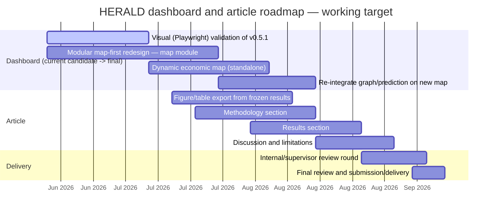

# HERALD 05 — Observatory Dashboard and Article Roadmap

**Created:** 2026-06-18 (canonical consolidation pass).
**Status:** Documentation only — restates `reports/HERALD_CURRENT_STATE.md`,
`reports/HERALD_RESEARCH_GANTT.md`, and the Observatory contract/correction-audit reports.
If this document disagrees with any of those, they win.
**Represents:** `HERALD_OBSERVATORY_V01_DATA_CONTRACT.md`,
`HERALD_OBSERVATORY_V03_AUDIT.md`, `HERALD_OBSERVATORY_V04_GRANULAR_CONTRACT.md`,
`HERALD_OBSERVATORY_V05_PREDICTION_GAP.md`, `HERALD_OBSERVATORY_V051_CORRECTION_AUDIT.md`,
and `reports/HERALD_RESEARCH_GANTT.md`. None deleted — see
`reports/HERALD_REPORTS_CONSOLIDATION_MAP.md`.

---

## 1. Dashboard lineage

| Version | File | Status | What it added |
|---|---|---|---|
| France original | `reports/dashboards/herald_france_final_dashboard.html` | ACTIVE, do-not-modify-casually | The original operational base (May 2026) every later Observatory version was incrementally adapted from |
| v0.3 | `herald_observatory_v03_dashboard.html` | ACTIVE, historical | Sector precedence layer integrated; choropleth + sector graph + economic states + territory heatmaps (DEC-035/036) |
| v0.4 / v0.4.1 | `herald_observatory_v04_granular_dashboard.html` (same physical file for both milestones — see naming note below) | ACTIVE, stable/historical baseline | Granular FR ZE2020/NL COROP/PT Municipal exports, observed-only relation graph, blocked-proxy panel isolated; v0.4.1 added real PT choropleth + dynamic timeline/graph + map↔graph linking |
| v0.5 | `herald_observatory_v05_narrative_dashboard.html` | HISTORICAL, superseded for dashboard-readiness only | Layperson narrative layer — **rejected** by the product owner as a polished MVP, not a complete-method presentation (English UI, PT prediction gap left open, sector graph not wired to map) |
| v0.5.1 | `herald_observatory_v051_narrative_dashboard.html` | **CURRENT CANDIDATE, not final** | Corrects every v0.5 point: French UI, "Méthode HERALD" architecture diagram opens the page, PT municipal prediction closed (DEC-068, no proxy, no HPC), real "Bassins économiques" geographic heatmap, graph-to-map wiring |

**Naming note (from `reports/HERALD_NAMING_CONVENTIONS.md` §1):** v0.4 and v0.4.1 share one
physical HTML file — the v0.4.1 builder regenerates it in place. This is intentional, not
a missing file.

---

## 2. Why v0.5.1 is still a candidate, not final

- **103/103 structural tests pass** (`tests/test_observatory_v051_narrative_dashboard.py`)
  — but these are DOM-id / embedded-JSON / handler cross-reference checks, **not** a real
  rendered screenshot.
- **No Playwright/headless-browser validation has ever been performed**, for any
  Observatory version from v0.3 through v0.5.1. This is a repeated, honest limitation, not
  unique to v0.5.1.
- The product owner's own signalled next step is a **modular, map-first redesign** — the
  current build is a single monolithic HTML file (18.2 MB), and the next iteration should
  split the map into its own reusable, testable module before extending graph/prediction
  layers on top of it. This work has **not started**.
- Decision string: `OBSERVATORY_V051_CANDIDATE_NEEDS_MAP_REDESIGN` (DEC-068).

**What "done" looks like before v0.5.1 (or its successor) can be called final:**
1. Visual validation (Playwright or manual, with a documented checklist) confirming the
   map, graph, and timeline actually render and respond as the structural tests assume.
2. The modular map-first redesign, or an explicit decision that the monolithic build is
   acceptable for the article's purposes.

---

## 3. What's missing for the article

| Item | Status | Source |
|---|---|---|
| Figures/tables from frozen results | **Not started** — no figure-export pass since Phase 8 | `HERALD_CURRENT_STATE.md` ("Writing/article", ~5%) |
| Methods section draft | Not started | — |
| Results section draft | Not started | — |
| Discussion/limitations draft | Not started | — |
| Outline | None exists | — |
| Venue selection | Not done | — |

---

## 4. Roadmap Gantt (Jul–Sep 2026, planned)

This is a **working target, not an externally confirmed deadline** — no supervisor/venue
deadline is documented anywhere in this repository as of 2026-06-18
(`reports/HERALD_RESEARCH_GANTT.md`, `DATE_LIMITE_A_CONFIRMER`).

---

## 5. What the final dashboard should be (design intent, not yet built)

Per the product owner's signalled direction (recorded across `HERALD_CURRENT_STATE.md` and
the decision log, not invented here):

1. **Map-first, modular** — the map is its own component, independently testable, not
   embedded in one monolithic builder.
2. Graph and prediction layers attach to the map module rather than the reverse.
3. Visual validation (Playwright or equivalent) is part of the build/test cycle going
   forward, not a deferred afterthought.
4. The evidence-tier vocabulary (observed/proxy/robust/supported/exploratory/blocked) and
   the NL gemeente proxy exclusion rule must survive the redesign unchanged — these are
   frozen scientific decisions (Charter §7), not dashboard implementation details.

---

## Cross-reference

- Phase-by-phase narrative: `reports/canonical/HERALD_01_PROJECT_PHASES_AND_TRAJECTORY.md`
- Data provenance: `reports/canonical/HERALD_02_DATA_PROVENANCE_AND_GRANULARITY.md`
- Methods/architecture: `reports/canonical/HERALD_03_METHODS_AND_ARCHITECTURE.md`
- Full claim/evidence table: `reports/canonical/HERALD_04_RESULTS_EVIDENCE_AND_CLOSED_BRANCHES.md`
- Detailed Gantt with status checks: `reports/HERALD_RESEARCH_GANTT.md`
